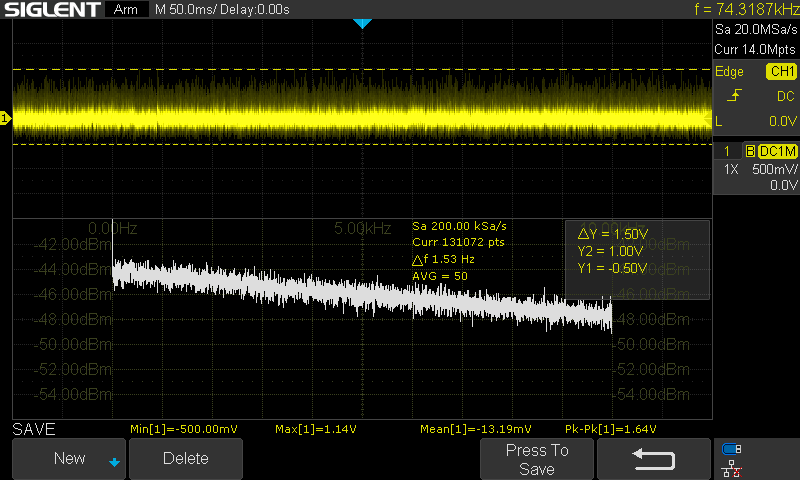
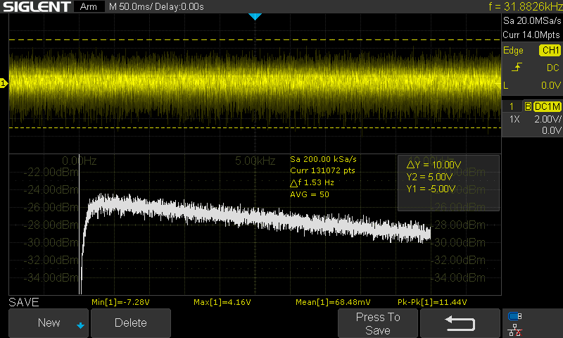
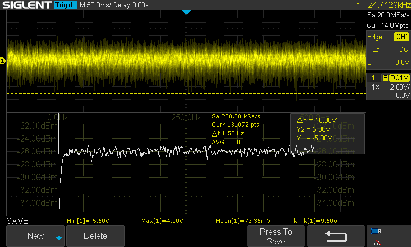
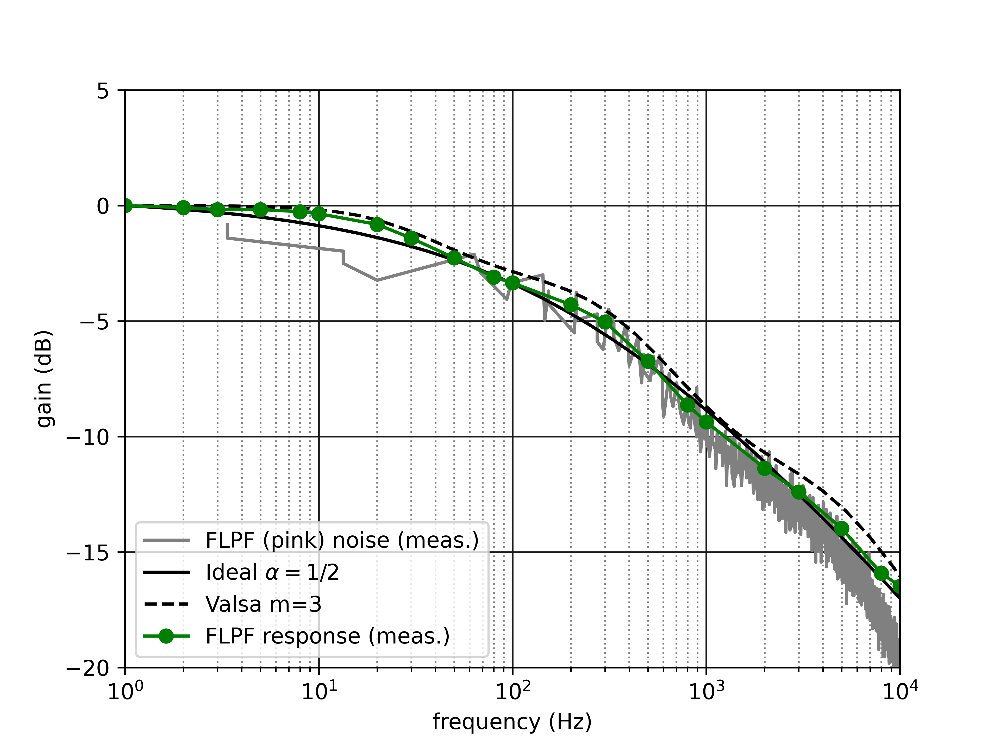
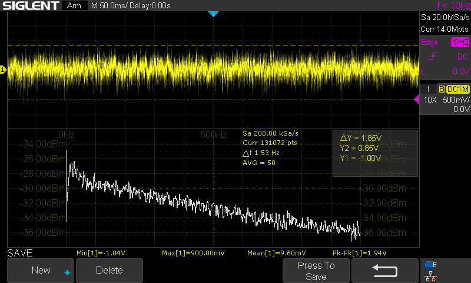

Design Notes
============

References
----------

#. Ray Wilson, "Noise Cornucopia" `musicfromouterspace.com <https://musicfromouterspace.com/analogsynth_new/NOISECORNREV01/NOISECORNREV01.php>`_
#. Eddy Bergman, "Synthesizer Build part-31: NOISE MODULE with 5 TYPES OF NOISE + Random Gates" `eddybergman.com <https://www.eddybergman.com/2020/05/synthesizer-build-part-31-noise-module.html>`_
#. Moritz Klein, "Designing a white, pink & blue noise generator from scratch" `youtube.com <https://www.youtube.com/watch?v=0yB_h_wFkh4>`_
#. Yves Usson, "Noise generator / Sample & Hold" `YuSynth <http://yusynth.net/Modular/EN/NOISE/index.html>`_
#. Rene Schmitz, "White Noise Source" `schmitzbits.de <https://schmitzbits.de/noise.html>`_
#. Juraj Valsa and Jiri Vlach, "RC models of a constant phase element," *Intl. J. Circuit Th. and App.* **41** p59 (2013) `doi <https://doi.org/10.1002/cta.785>`_

Transistor Biasing
------------------

In the MFOS design, the noise-generating transistor is biased through a pair of 470k resistors with a 1uF decoupling capacitor to attenuate power supply ripple. This isn't required for a low-noise supply: both verions published by Klein and Bergman use a single R to +12V. There are few choices published here ranging from 47k (YuSynth version) to 130k (Eddy Bergman). 

* lower values result in larger amplitude noise outputs and less asymmetry between positive and negative peak voltages
* the noise is AC coupled, so the time average tends to 0V

In the end, I stuck with 100k, which in my test gave a difference of about 0.5V between the absolute value of the negative and positive peak voltages (e.g. :math:`V_{min}\simeq -0.5V` to :math:`V_{max}\simeq 1.0V`) in the first gain stage. 

Gain
----

The MKI design uses a single gain stage. This has the disadvantage of amplifying the "DC offset." Although there's a high-pass filter between the collector and the opamp (corner frequency ~0.7Hz), a slow-varying mean (est. :math:`\pm 1mV`) is amplified. I chose a first stage gain of ~20 (:math:`R_f=470k\Omega`, :math:`R_g=22k\Omega`) and see a mean that fluctuates around :math:`\pm 20mV` for a :math:`1.5 V_{pp}` output. This would increase to :math:`> \pm 100mV` if the first stage gain were increased to give a 10Vpp signal.

Adding a second stage with a second high-pass filter improves the offset, but doesn't eliminate it: a +60mV mean is measured for the signal at the second stage output. The second stage transfer function (assuming an ideal opamp)

.. math::

  \frac{V_i j\omega C_1}{1 + j\omega R_1 C_1} &= \frac{V_o}{R_f} \\
  \to \frac{V_o}{V_i} &= \frac{j\omega R_f C_1}{1 + j\omega R_1 C_1} \\
  \to |H| &= \frac{R_f}{R_1}\frac{1}{\sqrt{1 + \frac{\omega_{c1}^2}{\omega^2}}} 

gives the corner frequency defined by the product :math:`\omega_{c1} = \frac{1}{R_1 C_1}` and a gain of :math:`\frac{R_f}{R_1}`. Increasing :math:`R_1` and :math:`C_1` reduces the high-pass corner. Increasing :math:`R_f` compensates for increasing :math:`R_1`.

The gain used in the MFOS design to bring the white noise to approximately 10Vpp seems to be too large as given in the schematic. To fix this and also reduce the high-pass effect in the second stage,

* Reduce the first stage gain to :math:`~20` (:math:`R_f = 470k`, :math:`R_n = 22k`)
* Increase the block capacitor from 100n to 1u (:math:`C_1` in the high-pass circuit)
* Increase the input resistor to the second stage opamp (:math:`R_1` in the high-pass circuit) from 10k to 22k
* With that change, keep the trim pot in the second stage opamp feedback at 470k and adjust to obtain 10Vpp

*Aside:* this appears in Eddy Bergmans's notes, too. He suggests reducing the range of the trim pot. 

As described in the MFOS design (:math:`R_1=10k` and :math:`C_1=100n`), the second stage high-pass has a corner around 160Hz:

Changing the high-pass and gain moves this corner below 10Hz:

The signal has a 10Vpp range with a 70mV mean and a bias of -1.5V (negative peaks -5.5V, positive peaks 4.0V). 

Filtered Noise
--------------

In the MFOS-inspired designs, a first order LPF (20dB/dec., 6dB/oct.) is used to generate low-pass noise. The YuSynth version and the design from MKI both use a "shelf" filter with 3 poles to approximate a 10dB/dec. (3dB/oct.) slope, which is characteristic of `pink noise <https://en.wikipedia.org/wiki/Colors_of_noise#Pink_noise>`_. 

There are a few references on fractional filter design, including Valsa2013, that give a procedure for generating R and C values. Using that as a guide (see associated Jupyter notebook), I implement a similar -10dB/dec. filter to the YuSynth and MKI designs, using a 60Hz corner frequency. In the figure below, I compare 

* the ideal fractional filter response (-10dB/dec)
* the simulated response for the filter using Valsa's method to generate a fractional capacitor
* the measured response of the filter to a frequency-swept sine input
* the measured spectrum of the filtered noise

The implemented filter leaves out the additional R & C that Valsa defines to improve the phase response and force roll-off at high frequencies, so the topology is the same as the usual approximations with three branches. 

The measurement of the filtered noise was done on the buffered output of the filter (unity gain), so an offset is applied in the figure above to align the curves. In the implementation, the same gain as in MKI's design is used to restore the pink noise to approximately 10Vpp. The measured pink noise is an average of 50 traces, and the scope's (Siglent SDS-1104X-E) FFT is used to generate the spectrum, which was then digitized using `WebPlotDigitizer <https://apps.automeris.io/wpd4/>`_ to extract the values from the image. 

Grainy Noise
------------

This is a great feature from the Noise Cornucopia (MFOS), but is quite sensitive. It seems to naturally have a bias towards negative pulses, with positive pulses only kicking in with the control near maximum (as both thresholds approach 0V). This is used in the MFOS design to reduce the rate of triggering for random gates. The sign of the pulse does not have an audible impact.

* Add a trim pot to set the balance between the negative and positive threshold. 

  * This works well, but requires a scope and tuning is sensitive.
  * This may be useful if the positive pulses are specifically required (e.g. positive edge to trigger or sync on).
  
* Tried an LM393 comparator 

  * Even with threshold adjustment, this never gave an even distribution of positive and negative pulses.
  * It is much more sensitive and almost always generates negative pulses with the default max/min thresholds. Need to increase the maximum thresholds (reduce the size of the tail resistors to e.g. 22k) to enable turning off the grains.

* Tuning with the 100k graininess control pot is very sensitive (TL07x as comparator; in parallel with 220k)

  * it has a large deadband (0-80% of the range does nothing): the TL07x doesn't trip for offsets above about 12V
  * it goes from a few ticks to dense static in a very small range (a few %)
  * TODO: try an anti-log taper

Modifications
-------------

#. single sided graininess (use free'd up opamp from 1)
#. slow varying random voltage (from YuSynth) - no: build a S&H with glide
